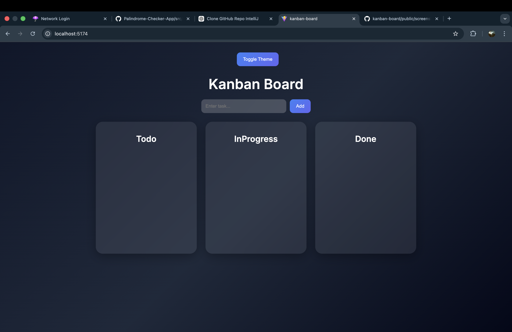

# 🚀 Kanban Board (Task Manager)

A modern and minimal **Kanban Task Management App** built using **React + Vite**.
Organize your tasks into *Todo → In Progress → Done* with a clean UI and smooth experience.

---


## ✨ Features

* 📝 Add tasks instantly
* ✏️ Edit tasks anytime
* ❌ Delete tasks
* 🌙 Dark / Light mode toggle
* 💾 Data saved in Local Storage
* 🎨 Glassmorphism UI with modern design

---

## 📸 Screenshots

> 📂 All screenshots are stored inside: `public/screenshots/`

### 🧾 Board View



### ➕ Add Task


### ✏️ Edit Task


---

## 🛠️ Tech Stack

* ⚛️ React (Vite)
* 🎨 CSS (Custom styling)
* 💾 Local Storage (Persistence)
* 🚀 Vercel (Deployment)

---

## ⚙️ Installation & Setup

Clone the repository:

```bash
git clone https://github.com/aanyaagrawal26/kanban-board.git
cd kanban-board
```

Install dependencies:

```bash
npm install
```

Run locally:

```bash
npm run dev
```

Build for production:

```bash
npm run build
```

---

## 📁 Project Structure

```
kanban-board/
│── public/
│   └── screenshots/   ← 📸 screenshots stored here
│── src/
│   ├── App.jsx
│   ├── index.css
│   └── main.jsx
│── package.json
│── vite.config.js
```

---

## 🚀 Deployment

This project is deployed using **Vercel**.

To deploy:

1. Push code to GitHub
2. Import repo in Vercel
3. Click Deploy

---

## 💡 Future Improvements

* 🔄 Drag & Drop functionality
* 📅 Due dates & priority tags
* 🔔 Notifications
* 📱 Mobile responsiveness improvements

---

## 🙌 Author

**Aanya Agrawal**
💻 BTech CSE Student

---

## ⭐ If you like this project

Give it a ⭐ on GitHub — it helps a lot!
